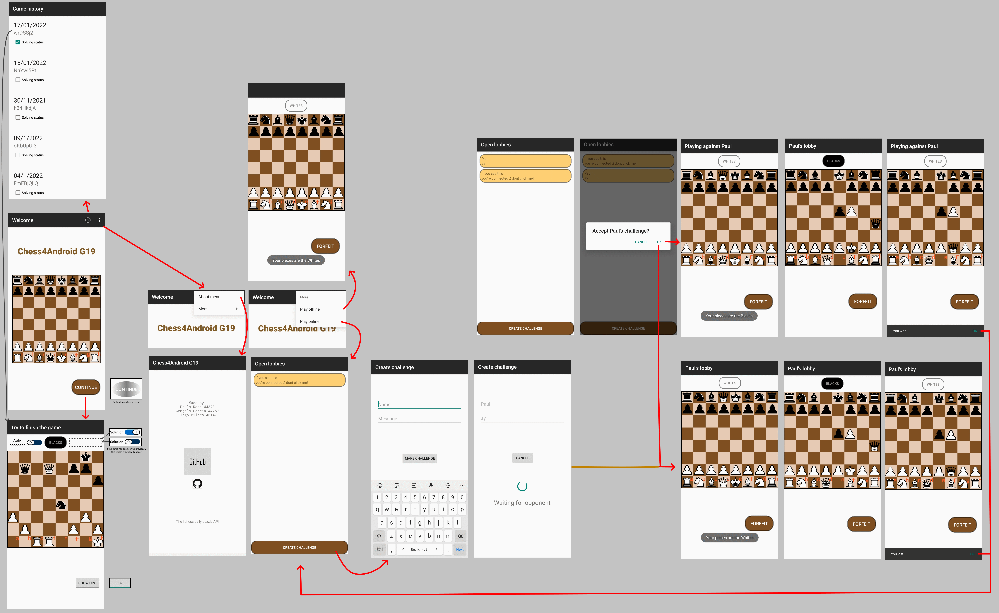

# Chess games app made for Mobile Device Programming discipline
You can:
- Play chess offline
- Play online with other users. Create a challenge/lobby, and wait for someone to accept.
- Solve daily chess puzzles obtained from the [lichess API](https://lichess.org/api/puzzle/daily). You can try these puzzles on the browser [here](https://lichess.org/training/daily). These puzzles get saved on the app, along with their states of completion and meta-data, like the ID and date.

Current tasks: 
- Fix some bugs
- Add missing chess rules (pawn promotion and En passant)
- Simplify and organize some stuff
- Update AppDocumentation
- Add more functionalities

## Shortcuts for main source code
- [src](Chess4Android/app/src/main/java/pt/isel/pdm/chess4android)
- [layout (activities)](Chess4Android/app/src/main/res/layout)

## [Read this on how to deploy and install!](Deploy%20guide.md)

## Repository contents
- **_imgs** -> Images used in this README file or other images with technical details
- **AppDocumentation** -> Images, diagrams and texts that explain the app on a programmer level and user level
- **Chess4Android** -> The android project. Open it using Android Studio
- The 3 .pdf's named after PDM in this directory are the 3 assignment papers that outline the goals and work to be done in each one.
- this README file, explains what this entire repository is about, a thing most people don't do for some reason
- src_code shortcut, a directory independent shortcut to the source code, opens it in another explorer window
- open in VSC, a short cut to open this directory with VSC wich facilitates browsing through this repo files, especially for the documentation
- The rest is self explnatory

## Activity/Screens demonstration

## Fundamental libraries and technologies used
- [Kotlin serialization](https://github.com/Kotlin/kotlinx.serialization). Used for turning the json string data obtained from the lichess API and convert it to an object
- [Android Volley](https://developer.android.com/training/volley/simple). Used for making a get request do the lichess API
- [Android Room](https://developer.android.com/training/data-storage/room). Used for storing chess puzzles in the phone's local database
- [Firebase](https://developer.android.com/studio/write/firebase?hl=en). Used for playing online. To create games, accept games and pass data between the user's moves and player turns.
- [ViewModel](https://developer.android.com/topic/libraries/architecture/viewmodel?hl=en). Used for saving data from an activity when the activity rotates or is when it's running in the background
- [LiveData](https://developer.android.com/topic/libraries/architecture/livedata?hl=en). Used for observing values in the activity's ViewModel and notifying them to the activity

## This is how proud I am for doing this project. ALL DONE BY ME

### Classification
- 17/20 (this project)
- 14/20 (exam)

Special thanks to:
- My teacher, [Paulo Pereira](https://github.com/palbp), for his teaching skills, good humor and personality and help. My teacher [youtube playlist for the semester I did this discipline](https://www.youtube.com/playlist?list=PL8XxoCaL3dBj-9DhstfK_krmviLwfN7mX)
- Joe Rogan for keeping me entertained while listening to his podcasts, which avoided me from crashing my dopamine while doing this project. And thus, keeping me focused
- Three 6 Mafia's music for getting me through the some stress I go through sometimes and for giving me resilience, hype me up, make me man up and put in work

### Aftermath 
This project proved to me once more that in order to do great work, you must be focused. It's way too hard to do 5 disciplines in a semester at the same time while you have 3 assignments/projects for each one, plus, given the fact that most of the time you have to do it all alone. Everything takes a lot of time to do and learn. I exceled at this discipline because I sacrificed others...
