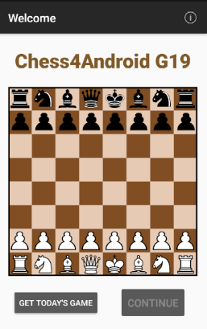

# PDM-2122i-LI5X-G19
Chess Puzzle solving app for Mobile Device Programming discipline.
Using: lichess API

## Shortcuts for main source code
- [src](Chess4Android/app/src/main/java/pt/isel/pdm/chess4android)
- [layout (activities)](Chess4Android/app/src/main/res/layout)

## Authors
- Paulo Rosa 44873
- Gonçalo Garcia 44787
- Tiago Pilaro 46147

# Tags
### Tag **chess_royale_1**
This app gets today's chess puzzle and displays it to the screen. The user can move pieces around according to the most fundamental chess rules. The confirmation that the moves inputed by the user go along with the solution is performed, but it wasn't extensively tested yet. It worked for the puzzle in the example bellow in the picture of the activity 2. The player will have to play with both piece colors

The limitations in this tag are the organization of the code and the lack of 1 chess rule (to my knowledge):
- **The carryover of the translation of the list of the moves indicated by the json to correctly alter or reflect upon the pieces's condition-states is not totally yet considered as do some other chess rules**. Per example, when a pawn reaches the other side, it turns into another piece except king and pawn, or handling of the king and queens castles when done by the user. This is some way is because the pieces dont yet have the capacity or access to have knowledge of the piece it's going to eat or affect, it only knows the position that the controller told him to go. This involves giving more info to the pieces. This fauly design also made the listener we set up for the tile a bit big because only the controller has acess to the board, and each individual piece doesn't.
- General organization and uniformization of the coding of the moves

### Activity 1

### Activity 2
Example from puzzle with id = KU4e1TVf

Date: 21/11/2021

### Activity 2 after completing a game

### Activity 3

### Navigation details
- For every activity, it supports rotating the phone to landscape. No data will be lost due to the use of ViewModel
- In the 1st Activity, there's a button called **get todays game" to get the puzzle and solution from the API and loads it into memory. The continue button will be enabled once this is done. If the request fails, it will launch an appropriate snackBar for the matter. Clicking back on the main Activity will not destroy it since onBackPressed was redefined.
- In the 2nd Activity, a toast will appear if the movement corresponds to the solution. And a snackBar will appear if the user completed the puzzle, on click, it will return to the main activity
- In the 3rd Activity, there's a textView with the names of the authors, a textView that acts like a button which links to this repo, an image of the github icon, and a textView that also acts like a button which will open the URL to the daily puzzle API.

### Tag **chess_royale_2**

## Consult today's game here
- https://lichess.org/training/daily
- https://lichess.org/api/puzzle/daily (json)

## Places to learn coordinates and moves
- https://lichess.org/analysis
- http://www.chessfornovices.com/chessnotation2.html
- https://en.wikipedia.org/wiki/Rules_of_chess
- https://levelup.gitconnected.com/finding-all-legal-chess-moves-2cb872d05bc6
- http://www.jimmyvermeer.com/rules.html
- https://www.chess.com/forum/view/game-analysis/in-a-computer-analysis---means-what
- https://www.chess.com/forum/view/general/all-the-terminology-and-symbol-meanings