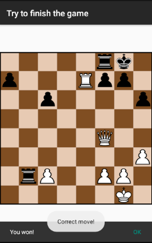

# Tags
### Tag **chess_royale_1**
This app gets today's chess puzzle and displays it to the screen. The user can move pieces around according to the most fundamental chess rules. The confirmation that the moves inputed by the user go along with the solution is performed, but it wasn't extensively tested yet. It worked for the puzzle in the example bellow in the picture of the activity 2. The player will have to play with both piece colors

The limitations in this tag are the organization of the code and the lack of 1 chess rule (to my knowledge):
- **The carryover of the translation of the list of the moves indicated by the json to correctly alter or reflect upon the pieces's condition-states is not totally yet considered as do some other chess rules**. Per example, when a pawn reaches the other side, it turns into another piece except king and pawn, or handling of the king and queens castles when done by the user. This is some way is because the pieces dont yet have the capacity or access to have knowledge of the piece it's going to eat or affect, it only knows the position that the controller told him to go. This involves giving more info to the pieces. This fauly design also made the listener we set up for the tile a bit big because only the controller has acess to the board, and each individual piece doesn't.
- General organization and uniformization of the coding of the moves

### Activity 1 and 2

 

### Activity 3

### Navigation details
- For every activity, it supports rotating the phone to landscape. No data will be lost due to the use of ViewModel
- In the 1st Activity, there's a button called **get todays game" to get the puzzle and solution from the API and loads it into memory. The continue button will be enabled once this is done. If the request fails, it will launch an appropriate snackBar for the matter. Clicking back on the main Activity will not destroy it since onBackPressed was redefined.
- In the 2nd Activity, a toast will appear if the movement corresponds to the solution. And a snackBar will appear if the user completed the puzzle, on click, it will return to the main activity
- In the 3rd Activity, there's a textView with the names of the authors, a textView that acts like a button which links to this repo, an image of the github icon, and a textView that also acts like a button which will open the URL to the daily puzzle API.

### Tag **chess_royale_2**
### Aditions and notes:
- The app stores the each puzzle obtained for each day locally on the phone and all of it's details. Including if it's done. This list is displayed in a new activity called the GameHistoryActivity
- When opening a solved puzzle, a switch will be available for viewing the solution. While the switch is on, the user cant move pieces. When opening a non-solved puzzle, this switch will not appear.
- The app tries to get the puzzle from the API in a repeatedly in an interval of 12hours (this is done with WorkManager) and stores it in the app's database. If the phone already has the app for today, it will access the database and not make a request to get the JSON from the API. Thus, the app's android programming design was altered so that it contains a Repository, which will have all of the app's I/O related to writing and reading a puzzle(our GameDTO) passing through it.
- Added switch that will autoPlay (you vs the phone if you will, using the solution) after correctly moving a piece.
- Added toggleButton so the user knows the color of the piece that is playing
- The user now cannot move pieces if it doesn't correspond to the solution of the puzzle.
- Given the previous alterations, the "Get todays game" in the MainActivity was removed
- A variety of sounds where added to cheer up the app. When: loading a game successfully, trying to move a piece in the wrong direction, moving a piece in accordance to the solution, winning the game and trying to click a checkBox that is not checked in the GameHistoryActivity
- Added indication of the column letter in the layout, but it's very small atleast in emulator :/
- AppDocumentation folder added with many helpful diagrams to understand and visualize the app.
- Major indentified problem with in this point in time: code could be more organized. Part of this was to blame to the fact that I wanted to try different approaches and coding styles while adapting and learning kotlin or/and learn new things in android, and therefore I ended up using a variety of things. And I will try to solve all of this next.

 

### Tag **chess_royale_3**
### Aditions and notes (user):
- Option to play chess games offline (you play alone, against yourself or with a friend by sharing the phone)
- Play online with other users, using firestore-firebase
- There are 3 new activities, ChessGameActivity, ChallengesListAcitivty and CreateChallengeActivity. ChessGameActivity is used for playing offline and online games. To play online or offline, the user will have to select the 3 dots button, select the "More" section and tap "Play online" or "Play offline". If the user selects "Play offline", the ChessGameActivity will launch. If the user selects "Play online", ChallengesListAcitivty will be launched, which will display the currently open challenges. To create a challenge, the user much create one with the button on the bottom and wait for some other user to accept it after selecting it from the list.
- Added forfeit button (NOT IN THE IMAGES, BUT ITS THERE)
- Supports landscape view
- Draw-backs: some repetitive code, some lack of code organization or simplicity.

